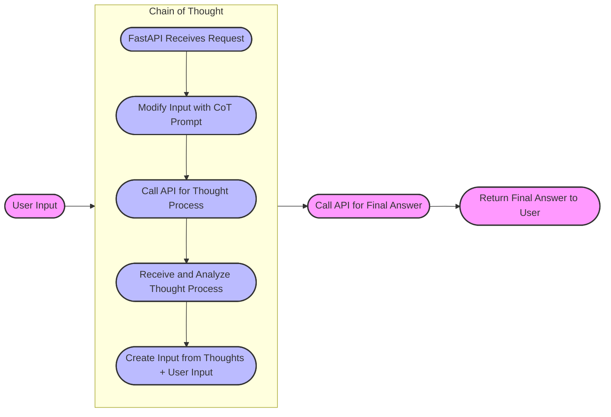
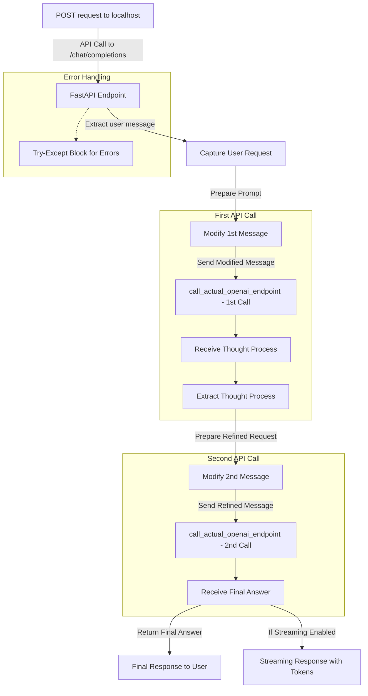

# CoT at Home

This project provides an OpenAI-compatible API proxy that automatically adds Chain-of-Thought (CoT) reasoning, allowing you transparently add CoT to your use of any models.



## Getting Started

### Prerequisites

Required:
   * An [OpenAI Compatible Endpoint](https://platform.openai.com/docs/api-reference/chat/create)
      * An API key (set in `.env` file as `OPENAI_API_KEY`)
      * Your API base URL (set in `.env` file as `OPENAI_API_BASE`) e.g.:
         * OpenAI: https://api.openai.com/v1
         * Azure: https://models.inference.ai.azure.com
         * VertexAI: https://us-central1-aiplatform.googleapis.com/v1beta1/projects/gcloud_project_id/locations/us-central1/endpoints/openapi

Optional:
   * Docker
      * To run without Docker install the `poetry` environment and run the `cot.py` script
   * Make
      * Only used to simplify Docker build and run


### Setup

1. **Clone the repository:**

   ```bash
   git clone <repository_url>
   cd cot_at_home
   ```

2. Create an .env file:

   ```bash
   echo "OPENAI_API_KEY=<your_openai_api_key>" > .env
   echo "OPENAI_API_BASE=<your_openai_api_base_url>" >> .env
   ```

3. Build and run the Docker image:

   ```bash
   make
   ```
   Starts the container on `localhost:5001`, point your application at this instead of your normal `OPENAI_API_BASE`.
   * Optionally change the port from the default `5001` to your choice
      ```bash
      make PORT=8080
      ```


4. Interact with the API:

   You can use the provided oai.py script or any OpenAI-compatible client to send requests to the API. Make sure to adjust the base_url in your client to http://localhost:5001.


## Makefile Commands

1. make all (default): Builds the Docker image and runs the container

2. make build: Builds the Docker image

3. make run: Runs the container, exposing the API on the specified port

## Notes
The API currently supports the /chat/completions endpoint for chat-based interactions.

The cot.py script acts as a proxy, forwarding requests to the actual OpenAI API while adding CoT reasoning capabilities.

Make sure to set the required environment variables in your .env file.

You can customize the port by modifying the PORT variable in the Makefile.

### Initial Architecture


## Acknowledgements

Thanks to https://github.com/antibitcoin/ReflectionAnyLLM/tree/main for the prompts